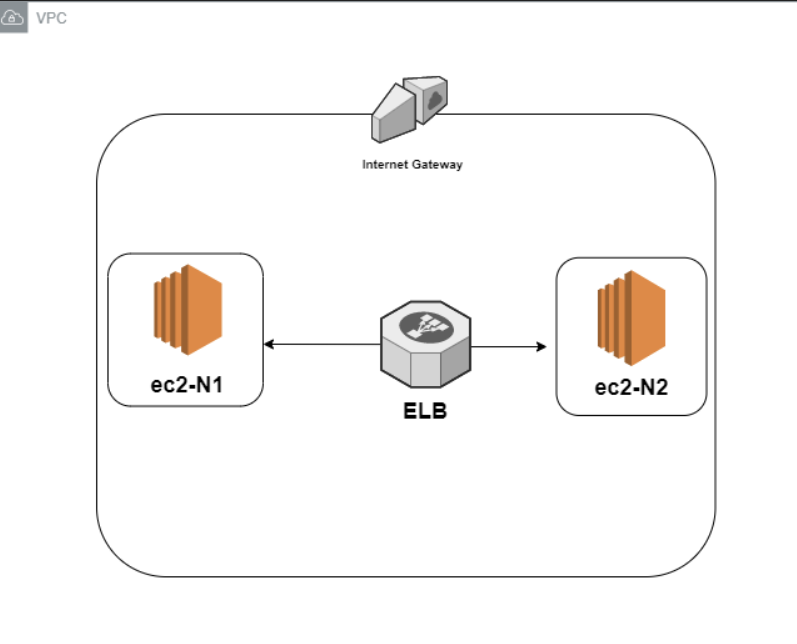

### **아키텍쳐를 설명해주세요**
아래의 아키텍처는 게임 웹 서비스를 하기 위해서 간단하게 구축한 아키텍쳐입니다.  

 

### VPC 
- vpc로 가상 개인 네트워크를 구축하였습니다.
 

### Subnet
- 이중화를 위해서 2개로 서브넷을 나누었습니다 (지역을 다르게 설정 하였음)
 

### ELB
- 지역을 각각 다르게 설정한 Subnet에 http 80번 포트에 대해 Load Balancer를 설정하였습니다.
 

### 구축할때 힘들었던 점이나 개선하고 싶은점
- aws의 기능들에 아직 익숙하지 않아서 아키텍쳐를 구현할때 어려움이 있었습니다.
- 아키텍쳐를 구성하였지만 내가 만든 아키텍쳐가 어떤 구성으로 구현됐는지 정확하게 알고 있지 않는 것 같다 (이 부분에 대해선 반성하고 공부를 더 해야겠다.)
- 간단한 아키텍쳐를 구현했음에도 불구하고 시간이 오래걸렸고 아키텍쳐를 어떻게 구성하는지 완벽하게 숙지하지 못 하였다.
- 구글링에 익숙해 지자

