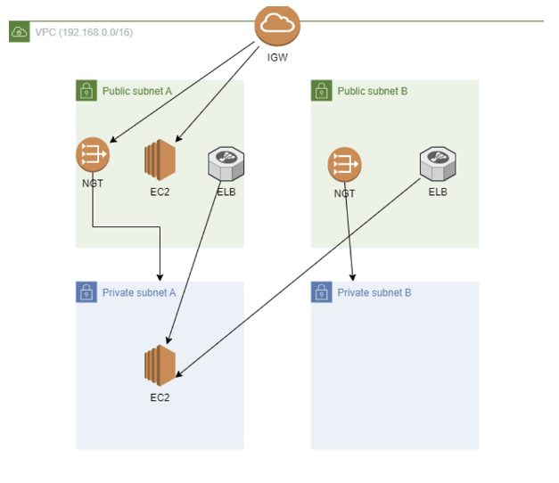

# 5월 5주차 실습 내용정리

아래와 같은 아키텍처를 직접 설계하고 ec2를 ssm으로 접속하는 방법을 알게 되어서 ssm으로 접속하고,  
public ec2에서 private ec2로 ping을 보내는 방법에 대하여 정리하였습니다.

설계한 아키텍처를 기반으로 서비스를 구축해 보겠다.

 

먼저 **VPC**를 생성해 준다.

 VPC 생성할때 subnet과 rtb 테이블 NAT gatway 등을 함께 만들 수 있는 옵션이 있지만 이번 실습에    서는 다 따로 생성해서 VPC에 연결해 주겠다.

- **이름 - testVPC**
- **CIDR - 192.168.0.0/16**

 

그 다음 **Subnet**을 생성해 준다. (Public 2개 Private 2개 → 총 4개)

- **VPC - 위에서 생성한 testVPC**
- **이름 - PublicSubnetA,B / PrivateSubnetA,B**
- **가용 영역 - 서브넷 이름에 맞게 선택 (ex - PublicSubnetA 이면 a 리전 선택)**
- **CIDR - 192.168.0.0/24(PublicA) / 192.168.1.0/24(PublicB) / 192.168.2.0/24(PrivateA) / 192.168.3.0/24(PrivateB)**

 

그 다음 **NAT 게이트웨이(NAT_GW)** 를 생성해 준다.

- **이름 - A-NATGATE / B-NATGATE**
- **가용영역 - A는 a, B는 b**
- **Subnet - public a, b**
- **Elastic ip - a,b 2개 다 할당해 주기**

생성해 준 NAT GateWay는 **testVPC에 연결**시켜 준다.

 

그 다음 **IGW(인터넷 게이트워이)** 를 생성해 준다.

- **이름 - testIGW**

생성해 준 IGW는 **testVPC에 연결**시켜 준다.

 

그 다음 **라우팅 테이블**을 생성해 준다. ( Public 1개, Private 2개 → 총 3개)

- **이름 - PublicRTB /  PrivateRTB_A / PrivateRTB_B**
- **VPC - testVPC**

생성해 준 **RTB의 규칙을 편집**한다.

- **PublicRTB의 target은 testIGW로 설정.**
- **PrivateRTB_A, B의 target은 NAT_GW A,B로 설정.**

 

그 다음 **보안그룹**을 생성해 준다.

- **이름 - testSG**
- **VPC - testVPC**
- **Inbound Rule - Port 22(ssh), 80(Http) , All ICMP IPv4 을 열어주기 (이때 ipv4의 모든 traffic이 들어올 수 있도록 source를 설정한다.)**
- **Outbound Rule - all traffic (모든 traffic이 나갈 수 있도록 설정)**

 

그 다음 **Role(역할)** 을 생성해 준다.

- **정책 이름 - AmazonSSMManagedInstanceCore**
- **역할 이름 - TestRole**

 

그 다음 **EC2**를 생성해 준다.

- **이름 - Public (1개), Private(1개)**
- **AMI - Ubuntu**
- **Key pair - 없이 지정**
- **VPC - testVPC**
- **Subnet - Public Ec2에는 Public subnet, Private에는 Private subnet으로 지정**
- **Security Group - testSG**
- **IAM - TestRole (SSM에 접근할 수 있는 권한 부여)**

 

이렇게 생성된 EC2를 SSM을 통해서 접속한 다음 `bash` , `sudo su` 명령어를 통해서 root 계정으로 진입한다. 

원래 Private ec2에 접근을 하려면 Public에 있는 bastion을 통해서 접근을 해야한다.
하지만 IAM Role에서 SSM에 접근할 수 있는 권한을 부여하고 SSM에 접속하게되면 
Private ec2도 접속가능하기 때문에 bastion 방식보다 더 편하다는 것을 알 수 있다.

그다음으로 해 볼 것은 public ec2와 private ec2를 ping 해 보는 것이다.

(참고로 Public Ec2와 Private Ec2는 **서로 같은 vpc**에 있기때문에 **서로 ping**이 가능하다.)

 

**[방법]**

1) `cd` (home 디렉토리 진입)

2) Private ec2의 ip주소 복사 후 Public ec2의 ssm 창에 붙여넣어주고 `-` 를 `.` 으로 변환시켜준다

3) ip 주소 앞에 `ping` 명령어 적어주고 ip 주소 뒤에 `-c 4` 입력.

이렇게 하면 Public ec2가 Private ec2에게 4번 ping을 보내고 걸린 시간을 알려준다.

 

### **[private에 있는 웹 서버 외부에 공개하기!]**

`apt update`  

`apt install nginx -y`  // nginx 설치

설치 후 Public Ec2의 ip주소 복사 후 웹 브라우져에 붙여넣어주면 welcome to nginx 창이 뜨게된다.

private에 있는 웹 서버를 외부에 공개하려고 하면 어떻게 해야할까?

→ **elb를 사용하면 된다.**

 

먼저 private ec2에서 nginx가  잘 작동하고 있는지 확인하기 →  `curl 127.0.0.1`  == `curl localhost`

(이때 이 주소는 aws가 ec2 생성시 자동으로 할당해 주는 주소임)

(+위 명령어 사용하면 알아서 get 요청을 보내줌.)

그 다음 alb를 생성해 준다. 

- **이름 - testLB**
- **Scheme - internet 선택**
- **ip 주소 - ipv4**
- **VPC - testVPC**
- **Subnet - public subnet a,b**
- **Security Group - testSG**
- **Target group을 생성한다 (이름: testTG, Port : http(80), Target : PrivateEc2 추가해 주기)**
- **Target Group - testTG**

ELB는 **같은 VPC에 있는 모든 서브넷에 접근할 수 있기** 때문에 Private EC2는 ELB를 통해서 외부와 통신이 가능하다. 

`cd /var/www/html`

`echo “Private Instance” > index.html`

elb의 주소 웹사이트에 복붙하면 private instance에 잘 접속된 것을 알 수 있다.

